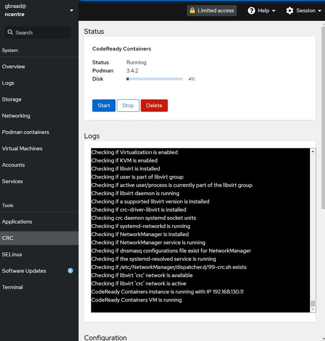

CRC Plugin for Cockpit
======================

### Installation

  * login to the remote server with a valid user
  * Cockpit needs to be installed and active:
    * `sudo [yum/dnf] install cockpit`
    * For more instructions see: https://cockpit-project.org/running.html
  * make sure the user can start VMs and CRC works:
    * `crc setup`
    * `crc start`
  * run `crc daemon` as a long running process (either use a `systemd` user service or screen)
  * place the module in `~/.local/share/cockpit/[crc]`

### Note

  * You might have to allow linger to prevent the daemon from being terminated after logout.
  * Make sure you run the latest development preview version of `crc`.  
    Please check the CRC releases for this: https://github.com/code-ready/crc/releases
